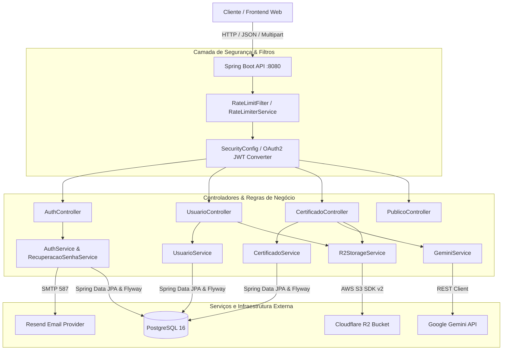

# 🎖️ Certifique-se

> Plataforma robusta e inteligente para gerenciamento, validação e exibição pública de certificados e conquistas profissionais, com extração automatizada via Inteligência Artificial (Google Gemini) e armazenamento de alta performance na nuvem com Cloudflare R2.

<p align="center">
  
  
  
  
  
  
  
  
</p>

---

## 📌 Sumário

- [Visão Geral](#-visão-geral)
- [Funcionalidades Principais](#-funcionalidades-principais)
- [Arquitetura do Sistema](#-arquitetura-do-sistema)
- [Stack Tecnológica](#-stack-tecnológica)
- [Mapeamento da Estrutura do Projeto](#-mapeamento-da-estrutura-do-projeto)
- [Mapeamento Completo de Endpoints (API REST)](#-mapeamento-completo-de-endpoints-api-rest)
- [Segurança & Proteção](#-segurança--proteção)
- [Integrações Externas](#-integrações-externas)
  - [Google Gemini API (Extração com IA)](#1-google-gemini-api-extração-inteligente)
  - [Cloudflare R2 Storage (S3-compatible)](#2-cloudflare-r2-armazenamento-de-arquivos)
  - [Serviço de E-mail (SMTP Resend)](#3-serviço-de-e-mail-smtp--resend)
- [Variáveis de Ambiente](#-variáveis-de-ambiente)
- [Como Executar o Projeto](#-como-executar-o-projeto)
  - [Pré-requisitos](#pré-requisitos)
  - [Opção 1: Via Docker Compose (Recomendado)](#opção-1-via-docker-compose-recomendado)
  - [Opção 2: Execução Local (Híbrida)](#opção-2-execução-local-híbrida)
- [Testes Automatizados](#-testes-automatizados)
- [Regras de Negócio e Limites](#-regras-de-negócio-e-limites)
- [Licença e Autoria](#-licença-e-autoria)

---

## 🎯 Visão Geral

O **Certifique-se** foi desenvolvido para resolver o problema clássico da dispersão de certificados e títulos acadêmicos/profissionais (geralmente espalhados em PDFs em pastas locais ou no histórico de e-mails).

A plataforma permite:
1. **Centralizar e catalogar** todas as certificações em um único lugar seguro.
2. **Eliminar o preenchimento manual**: através do envio de fotos (JPEG, PNG, WebP) ou PDFs, a IA analisa o documento e preenche instantaneamente título, instituição, carga horária, data de conclusão, tags e links de validação.
3. **Publicar um Portfólio Pessoal**: cada usuário dispõe de uma URL pública (`/public/usuarios/{username}`) que exibe suas conquistas, somatório de horas de estudo e habilidades comprovadas.

---

## ✨ Funcionalidades Principais

- 🤖 **Extração Inteligente por Visão Computacional / OCR com IA**:
  - Processamento multimodal via Google Gemini (`gemini-3.8-flash` com fallback automático para `gemini-3.5-flash` e `gemini-3.5-flash-lite`).
  - Extração estrita via JSON Schema com filtros anti-alucinação (ignora nomes de alunos como títulos de cursos, valida datas entre 1960 e hoje, padroniza URLs de validação).
- 🖼️ **Armazenamento de Mídia em Nuvem (Cloudflare R2)**:
  - Upload direto e seguro de certificados e avatares de perfil com geração de chaves únicas por UUID.
  - Proxy seguro de entrega de imagens (`/certificados/imagens/{chave}`) com headers de cache público e imutável por 1 ano.
  - Limpeza automática de arquivos obsoletos ou deletados executada apenas após confirmação transacional do banco (`TransactionSynchronizationManager`).
- 🌐 **Portfólio Público Compartilhável**:
  - Exibição de perfil com foto, bio, headline, contagem de certificados e total de horas computadas.
  - Controle de visibilidade granular (o usuário decide quais certificados serão públicos e pode desativar seu perfil a qualquer momento).
- 🔐 **Autenticação & Sessões Seguras**:
  - Arquitetura stateless via JWT com Spring Security OAuth2 Resource Server.
  - Controle de revogação de tokens em tempo real via claim `tokenVersion`: invalidando sessões antigas imediatamente após troca ou recuperação de senha.
- ⏱️ **Rate Limiting em Memória (Sliding Window)**:
  - Proteção ativa contra ataques de força bruta no Login (10 req/min).
  - Proteção contra spam de e-mails em Recuperação de Senha (5 req/2min).
  - Proteção contra exaustão de cota de IA (15 req/min).
  - Suporte a cabeçalhos de proxy reverso (`CF-Connecting-IP` e `X-Forwarded-For`).
- 📧 **Recuperação de Senha Segura via E-mail**:
  - Envio de token criptograficamente seguro via `SecureRandom` com validade de 30 minutos.
  - Armazenamento em hash SHA-256 no banco (o token original trafega apenas no link do usuário).
  - Template de e-mail em HTML responsivo e elegante.
- 🔍 **Busca & Filtros Dinâmicos**:
  - Filtros flexíveis por nome do curso, instituição, data de conclusão e tags utilizando JPA Specifications.
- 🛡️ **Prevenção de Duplicidades**:
  - Algoritmo de hash SHA-256 exclusivo gerado a partir do conteúdo do certificado, impedindo cadastros duplicados.

---

## 🏛️ Arquitetura do Sistema



---

## 💻 Stack Tecnológica

| Componente | Tecnologia / Biblioteca | Versão | Função |
| :--- | :--- | :--- | :--- |
| **Linguagem** | Java (Eclipse Temurin) | `21 (LTS)` | Ambiente de execução |
| **Framework Base** | Spring Boot | `4.0.5` | Ecossistema da aplicação |
| **Persistência** | Spring Data JPA / Hibernate | `7.2.x` | Mapeamento objeto-relacional |
| **Banco de Dados** | PostgreSQL | `16-alpine` | Banco de dados relacional principal |
| **Banco de Testes** | H2 Database | `2.4.x` | Banco de dados em memória para testes |
| **Migrações de Banco**| Flyway Database PostgreSQL | `11.14.x` | Versionamento evolutivo do esquema SQL |
| **Segurança** | Spring Security & OAuth2 JWT | Nativo | Autenticação stateless e autorização |
| **Armazenamento** | AWS SDK for Java v2 (S3) | `2.54.19` | Cliente S3 integrado ao Cloudflare R2 |
| **Inteligência Artificial**| Google Gemini API | `v1beta` | Extração de dados estruturados via Visão/OCR |
| **E-mails** | Spring Boot Starter Mail | Nativo | Envio de e-mails transacionais (Resend) |
| **Documentação** | SpringDoc OpenAPI (Swagger UI) | `2.8.9` | Especificação e interface interativa da API |
| **Utilitários** | Project Lombok | Nativo | Redução de código boilerplate |
| **Containerização**| Docker & Docker Compose | Multi-stage | Build e orquestração dos containers |

---

## 📂 Mapeamento da Estrutura do Projeto

Abaixo encontra-se o mapeamento detalhado da arquitetura de pacotes do projeto:

```text
Certifique-se/
├── .github/                            # Configurações de automação e workflows GitHub
├── README.md                           # Documentação central do ecossistema
└── certifiquese/                       # Raiz do projeto Spring Boot
    ├── .dockerignore                   # Arquivos ignorados no build Docker
    ├── .env.example                    # Modelo das variáveis de ambiente necessárias
    ├── CLOUDFLARE_R2.md                # Documentação técnica específica da integração R2
    ├── Dockerfile                      # Build multi-stage (JDK 21 compile -> JRE 21 runtime)
    ├── docker-compose.yml              # Orquestração do PostgreSQL 16 e aplicação
    ├── mvnw / mvnw.cmd                 # Maven Wrapper oficial
    ├── pom.xml                         # Dependências e plugins de build do Maven
    └── src/
        ├── main/
        │   ├── java/br/com/certifiquese/
        │   │   ├── CertifiqueseApplication.java  # Classe inicializadora da aplicação
        │   │   ├── config/                       # Configurações de beans (ex: R2Config com S3Client)
        │   │   ├── controller/                   # Camada de entrada REST (Controllers)
        │   │   │   ├── AuthController.java       # Login e fluxos de recuperação de senha
        │   │   │   ├── UsuarioController.java    # Gestão de perfil, avatar, senha e exclusão
        │   │   │   ├── CertificadoController.java# Upload, OCR via IA, CRUD e buscas
        │   │   │   └── PublicoController.java    # Endpoints públicos de portfólio e healthcheck
        │   │   ├── dto/                          # Records imutáveis de entrada/saída (DTOs)
        │   │   ├── exception/                    # Tratamento global de erros (RFC 7807 ProblemDetail)
        │   │   ├── model/                        # Entidades JPA (UsuarioEntity, CertificadoEntity, etc)
        │   │   ├── repository/                   # Interfaces Spring Data JPA
        │   │   ├── security/                     # Camada de segurança
        │   │   │   ├── authentication/           # UserDetailsService e UserDetails customizados
        │   │   │   ├── config/                   # SecurityConfig, PasswordConfig, JwtConfig
        │   │   │   ├── ratelimit/                # RateLimitFilter e RateLimiterService em memória
        │   │   │   └── token/                    # TokenService (geração e assinatura de JWTs)
        │   │   ├── service/                      # Regras de negócio da aplicação
        │   │   │   ├── email/                    # Contrato EmailSender e implementação SpringEmailSender
        │   │   │   ├── storage/                  # CertificadoStorage e R2StorageService
        │   │   │   ├── AuthService.java          # Autenticação e emissão de tokens
        │   │   │   ├── CertificadoService.java   # Gerenciamento de certificados e limites de planos
        │   │   │   ├── GeminiService.java        # OCR, extração multimodal e cadeia de fallback
        │   │   │   ├── RecuperacaoSenhaService.java # Lógica de tokens e disparo de redefinição
        │   │   │   └── UsuarioService.java       # Gestão de contas e perfis de usuário
        │   │   ├── specification/                # Filtros dinâmicos com JPA Specifications
        │   │   └── validation/                   # Validações customizadas (ex: DataConclusaoValidator)
        │   └── resources/
        │       ├── application.properties        # Propriedades de configuração do Spring Boot
        │       └── db/migration/                 # Versionamento Flyway do Banco de Dados
        │           ├── V0__create_initial_schema.sql
        │           ├── V1__add_criado_em_to_tb_usuario.sql
        │           ├── V2__add_role_to_tb_usuario.sql
        │           ├── V3__add_recuperacao_senha_and_token_version.sql
        │           ├── V4__add_campos_publicos_e_detalhes_certificado.sql
        │           └── V5__add_foto_to_tb_usuario.sql
        └── test/                                 # Suíte abrangente de testes automatizados (59 testes)
```

---

## 📡 Mapeamento Completo de Endpoints (API REST)

### 🔐 1. Autenticação (`/auth`)

| Método | Endpoint | Acesso | Rate Limit | Descrição |
| :--- | :--- | :--- | :--- | :--- |
| `POST` | `/auth/login` | Público | 10 req/min | Autentica com e-mail e senha, retornando token JWT e dados do usuário. |
| `POST` | `/auth/esqueci-senha` | Público | 5 req/2min | Dispara e-mail com link de redefinição para o endereço informado. |
| `POST` | `/auth/redefinir-senha` | Público | Livre | Redefine a senha utilizando o token recebido por e-mail e confirmação. |

### 👤 2. Usuários (`/usuarios`)

| Método | Endpoint | Acesso | Rate Limit | Descrição |
| :--- | :--- | :--- | :--- | :--- |
| `POST` | `/usuarios` | Público | Livre | Cadastra uma nova conta de usuário no sistema. |
| `GET` | `/usuarios/me` | Autenticado | Livre | Retorna os dados completos do usuário autenticado no momento. |
| `PUT` | `/usuarios/me` | Autenticado | Livre | Atualiza dados cadastrais (nome, headline, bio, username, perfil público). |
| `PUT` | `/usuarios/me/senha` | Autenticado | Livre | Altera a senha do usuário e invalida tokens JWT anteriores (`tokenVersion++`). |
| `POST` | `/usuarios/me/foto` | Autenticado | Livre | Faz upload de nova foto de perfil (Multipart, máx 3MB) e limpa a anterior no R2. |
| `DELETE`| `/usuarios/me/foto` | Autenticado | Livre | Remove a foto de perfil do usuário e exclui o arquivo no storage. |
| `DELETE`| `/usuarios/me` | Autenticado | Livre | Exclui permanentemente a conta, certificados e todos os arquivos no R2. |
| `GET` | `/usuarios` | `ROLE_ADMIN` | Livre | Lista todos os usuários cadastrados na plataforma. |

### 📜 3. Certificados (`/certificados`)

| Método | Endpoint | Acesso | Rate Limit | Descrição |
| :--- | :--- | :--- | :--- | :--- |
| `POST` | `/certificados/extrair-dados`| Autenticado | 15 req/min | Upload do arquivo + extração de metadados por IA (Gemini) + upload no R2. |
| `POST` | `/certificados/imagens` | Autenticado | Livre | Upload avulso de imagem no Cloudflare R2 (retorna chave e URL). |
| `GET` | `/certificados/imagens/{chave}`| Público | Livre | Retorna os bytes da imagem/PDF armazenados no R2 com cache público. |
| `POST` | `/certificados` | Autenticado | Livre | Cadastra um certificado validando limites de plano e hash exclusivo. |
| `PUT` | `/certificados/{hash}` | Autenticado | Livre | Atualiza os dados do certificado (se a foto mudar, limpa a foto anterior). |
| `GET` | `/certificados/me` | Autenticado | Livre | Consulta e filtra os certificados do usuário autenticado (query params). |
| `DELETE`| `/certificados/{hash}` | Autenticado | Livre | Deleta o certificado do usuário e remove o arquivo correspondente no R2. |
| `GET` | `/certificados` | `ROLE_ADMIN` | Livre | Lista todos os certificados cadastrados no sistema (visão administrativa). |

### 🌍 4. Endpoints Públicos (`/public`)

| Método | Endpoint | Acesso | Descrição |
| :--- | :--- | :--- | :--- |
| `GET` | `/public/usuarios/{username}` | Público | Retorna dados públicos do perfil (foto, headline, bio, total horas e certificados). |
| `GET` | `/public/usuarios/{username}/certificados` | Público | Lista os certificados com visibilidade pública do usuário (até o limite do plano). |
| `GET` | `/public/health` | Público | Healthcheck leve da API retornando `{ "status": "ok", "timestamp": "..." }`. |

### 📖 5. Documentação Interativa

| Endpoint | Acesso | Descrição |
| :--- | :--- | :--- |
| `/swagger-ui/index.html` | Público | Interface visual interativa para teste e inspeção dos endpoints |
| `/v3/api-docs` | Público | Especificação OpenAPI 3.0 em formato JSON |

---

## 🛡️ Segurança & Proteção

A aplicação adota práticas recomendadas para garantir a integridade dos dados e a disponibilidade do serviço:

1. **Tokens JWT com Invalidação Ativa (`tokenVersion`)**:
   - Cada usuário possui um contador `tokenVersion` no banco de dados, que é injetado como claim no token JWT.
   - A cada alteração ou redefinição de senha, o contador é incrementado, rejeitando instantaneamente qualquer token antigo em circulação.
2. **Rate Limiting Baseado em Janela Deslizante**:
   - Algoritmo implementado via `ConcurrentLinkedDeque` em memória por IP de origem.
   - Detecta e previne abuso de requisições sensíveis (tentativas de força bruta no login, spam de recuperação de senha e consumo excessivo da API de IA).
3. **Cabeçalhos de Segurança HTTP**:
   - **HSTS** ativado com `includeSubDomains` e `maxAge` de 1 ano.
   - **X-Frame-Options** configurado como `SAMEORIGIN`.
   - **X-Content-Type-Options** com `nosniff`.
4. **Política de CORS Abrangente e Parametrizável**:
   - Suporte dinâmico a origens locais (`localhost`, `127.0.0.1`), domínio customizado (`FRONTEND_URL`), Vercel, Render e GitHub Pages.
5. **Prevenção de Inconsistências de Arquivos no Storage**:
   - Operações de exclusão de arquivos no Cloudflare R2 são registradas e executadas apenas **após o commit da transação** no banco de dados (`TransactionSynchronizationManager.registerSynchronization`). Se o banco falhar, o arquivo físico não é perdido.

---

## 🔌 Integrações Externas

### 1. Google Gemini API (Extração Inteligente)
- **Modelos Utilizados**:
  - Modelo primário: `gemini-3.8-flash`
  - Cadeia de fallback automático: `gemini-3.8-flash` ➔ `gemini-3.5-flash` ➔ `gemini-3.5-flash-lite`
- **Comportamento Resiliente**: Caso a API do Google retorne `429 (Too Many Requests)`, `503 (Service Unavailable)`, `500` ou timeout de rede, a aplicação chaveia instantaneamente para o próximo modelo da cadeia sem falhar a requisição do usuário.
- **Estruturação JSON Estrita**:
  - O prompt instrui a IA através de `system_instruction` especializada e schema de retorno garantido.
  - Sanitização de títulos (rejeita termos genéricos como "Certificado de Conclusão" ou nomes de alunos no lugar do curso).
  - Normalização de links de validação e restrição de datas válidas (1960 até a data corrente).

### 2. Cloudflare R2 (Armazenamento de Arquivos)
- Armazenamento em nuvem com compatibilidade total com a API S3 da AWS.
- Configurado com `chunkedEncodingEnabled(false)` para total compatibilidade com assinaturas SigV4 do R2 no AWS SDK v2.
- Suporta dois modos de operação:
  - **Bucket Privado (Padrão)**: O backend atua como proxy seguro em `/certificados/imagens/{chave}` com cache imutável de 1 ano.
  - **Bucket Público / Domínio Customizado**: Quando `R2_PUBLIC_URL` é informada, o backend retorna diretamente a URL da CDN.

### 3. Serviço de E-mail (SMTP / Resend)
- Integração via `JavaMailSender` sobre TLS na porta 587.
- Envio de links seguros para recuperação de senhas com templates estilizados.

---

## ⚙️ Variáveis de Ambiente

Crie um arquivo `.env` dentro da pasta `certifiquese/` com base no arquivo `.env.example`:

```properties
# -----------------------------------------------------------------------------
# Banco de Dados PostgreSQL
# -----------------------------------------------------------------------------
POSTGRES_DB=certifiquese
POSTGRES_USER=certifiquese_user
POSTGRES_PASSWORD=certifiquese_pass
POSTGRES_PORT=5434

DB_URL=jdbc:postgresql://localhost:5434/certifiquese
DB_USERNAME=certifiquese_user
DB_PASSWORD=certifiquese_pass

# -----------------------------------------------------------------------------
# Autenticação JWT
# -----------------------------------------------------------------------------
# Chave HMAC-SHA de pelo menos 256 bits (32 caracteres ou Base64)
JWT_SECRET=REv8hRSr87eDme5ZpWBlfBrytarn66da9cVUpyGnpH8

# -----------------------------------------------------------------------------
# Configurações do Hibernate / JPA
# -----------------------------------------------------------------------------
JPA_DDL_AUTO=validate
JPA_SHOW_SQL=false
JPA_FORMAT_SQL=false

# -----------------------------------------------------------------------------
# Aplicação & Frontend
# -----------------------------------------------------------------------------
FRONTEND_URL=https://certifique-se.app

# -----------------------------------------------------------------------------
# Cloudflare R2 Storage (S3 API)
# -----------------------------------------------------------------------------
R2_ACCOUNT_ID=seu_account_id_cloudflare
R2_ACCESS_KEY_ID=sua_access_key_r2
R2_SECRET_ACCESS_KEY=sua_secret_access_key_r2
R2_BUCKET_NAME=certifiquese-bucket
# Opcional: Domínio customizado ou r2.dev (ex: https://arquivos.meudominio.com)
R2_PUBLIC_URL=

# -----------------------------------------------------------------------------
# Google Gemini API
# -----------------------------------------------------------------------------
GEMINI_API_KEY=sua_chave_de_api_gemini
GEMINI_MODEL=gemini-3.8-flash

# -----------------------------------------------------------------------------
# Envio de E-mails (Resend SMTP)
# -----------------------------------------------------------------------------
MAIL_HOST=smtp.resend.com
MAIL_PORT=587
MAIL_USERNAME=resend
MAIL_PASSWORD=re_sua_chave_resend_aqui
MAIL_FROM=Certifique-se <nao-responda@certifique-se.app>

# -----------------------------------------------------------------------------
# Rate Limiting
# -----------------------------------------------------------------------------
RATE_LIMIT_ENABLED=true
```

---

## 🚀 Como Executar o Projeto

### Pré-requisitos
- **Java 21** instalado (para desenvolvimento local sem Docker).
- **Docker** e **Docker Compose** instalados.
- **Git** para clonar o repositório.

---

### Opção 1: Via Docker Compose (Recomendado)

Esta opção inicializa o container do **PostgreSQL 16** e constrói o container da **Aplicação Spring Boot**:

1. Clone o repositório:
   ```bash
   git clone https://github.com/luanrichardsz/Certifique-se.git
   cd Certifique-se/certifiquese
   ```

2. Crie e preencha o arquivo `.env`:
   ```bash
   cp .env.example .env
   # Edite o .env com suas chaves (Gemini, R2, etc.)
   ```

3. Suba o ambiente com o Docker Compose:
   ```bash
   docker compose up --build -d
   ```

4. Verifique os logs da aplicação:
   ```bash
   docker compose logs -f app
   ```

5. A aplicação estará disponível em `http://localhost:8080`.
   - Documentação Swagger: `http://localhost:8080/swagger-ui/index.html`
   - Healthcheck: `http://localhost:8080/public/health`

---

### Opção 2: Execução Local (Híbrida)

Você pode subir apenas o banco de dados no Docker e rodar a aplicação localmente pelo Maven Wrapper:

1. Acesse o diretório do projeto:
   ```bash
   cd certifiquese
   ```

2. Suba apenas o serviço do PostgreSQL:
   ```bash
   docker compose up -d db
   ```

3. Configure o arquivo `.env` para apontar para `localhost:5434`:
   ```properties
   DB_URL=jdbc:postgresql://localhost:5434/certifiquese
   DB_USERNAME=certifiquese_user
   DB_PASSWORD=certifiquese_pass
   ```

4. Inicie a aplicação com o Maven Wrapper:
   ```bash
   ./mvnw spring-boot:run
   ```

---

## 🧪 Testes Automatizados

O projeto conta com uma suíte de testes robusta abrangendo testes unitários, testes de integração de controladores com `MockMvc`, testes de repositórios JPA, serviços de segurança e regras de negócio:

### Executar a suíte de testes padrão
```bash
cd certifiquese
./mvnw test
```

> **Resultado dos Testes**: A suíte executa com banco em memória H2 (`application-test.properties`) com 100% de sucesso (59 testes executados, 0 falhas, 0 erros).

### Executar o Teste Real de Integração com Cloudflare R2
Para validar a conectividade real com as credenciais do seu bucket R2 (lidas do `.env`):
```bash
./mvnw -q -Dtest=R2LiveSmokeIT test
```
*Este teste envia uma imagem PNG mínima ao bucket, verifica a persistência e remove o arquivo logo em seguida.*

---

## ⚖️ Regras de Negócio e Limites

Para proteger o consumo de recursos e viabilizar planos de monetização futuros, a plataforma aplica as seguintes regras:

| Regra / Limite | Plano Gratuito (`USER`) | Administrador (`ADMIN`) |
| :--- | :--- | :--- |
| **Total de Certificados** | Máximo de **15 certificados** | Ilimitado |
| **Certificados Públicos no Portfólio** | Máximo de **8 certificados** | Ilimitado |
| **Tamanho Máximo por Certificado** | 5 MB | 5 MB |
| **Tamanho Máximo da Foto de Perfil** | 3 MB | 3 MB |
| **Formatos Aceitos (Certificado)** | JPEG, PNG, WebP, PDF | JPEG, PNG, WebP, PDF |
| **Formatos Aceitos (Avatar)** | JPEG, PNG, WebP | JPEG, PNG, WebP |
| **Validação da Data de Conclusão** | 1960 até a data atual | 1960 até a data atual |
| **Anti-duplicação de Certificado** | Hash SHA-256 exclusivo | Hash SHA-256 exclusivo |

---

## 📄 Licença e Autoria

Projeto desenvolvido por **[Luan Richard](https://github.com/luanrichardsz)**.

Distribuído sob licença aberta para uso de portfólio e estudos. Sinta-se à vontade para contribuir via Pull Requests ou reportar melhorias na aba de Issues!
